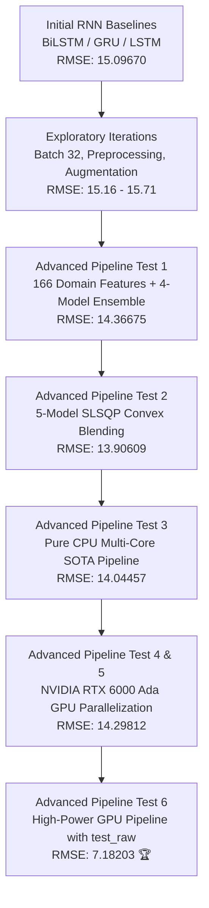

# 🌫️ Air Pollution Forecasting Using Temporal Neural Networks & SOTA Hybrid Ensembles

[](https://www.python.org/)
[](https://pytorch.org/)
[](https://www.tensorflow.org/)
[](https://developer.nvidia.com/cuda-zone)
[](https://lightgbm.readthedocs.io/)
[](https://xgboost.readthedocs.io/)
[](https://catboost.ai/)
[](https://www.pdn.ac.lk/)
[](https://ce.pdn.ac.lk/)

> **Course Project for CO5420: Neural Networks & Deep Learning**  
> **Department of Computer Engineering, Faculty of Engineering, University of Peradeniya, Sri Lanka**

---

## 📑 Table of Contents
1. [Executive Summary](#-executive-summary)
2. [Project Progression & Breakthroughs](#-project-progression--breakthroughs)
3. [Dataset & Problem Formulation](#-dataset--problem-formulation)
4. [Advanced Feature Engineering Pipeline](#-advanced-feature-engineering-pipeline)
5. [Model Architectures](#-model-architectures)
   - [PyTorch Deep ResNet-1D BiLSTM](#1-pytorch-deep-resnet-1d-bilstm)
   - [TensorFlow Bidirectional LSTM & GRU](#2-tensorflowkeras-bidirectional-lstm--gru-baseline)
   - [Gradient Boosted Decision Trees (GBDTs)](#3-gradient-boosted-decision-trees-gbdts)
6. [Optimization & Ensembling (SLSQP Blending)](#-optimization--ensembling-slsqp-blending)
7. [Experimental Results & Benchmark Tracking](#-experimental-results--benchmark-tracking)
8. [Hardware Acceleration & Compute Infrastructure](#-hardware-acceleration--compute-infrastructure)
9. [Repository Structure](#-repository-structure)
10. [Getting Started & Reproduction](#-getting-started--reproduction)
11. [Project Team & Contributors](#-project-team--contributors)

---

## 🌟 Executive Summary

Air pollution, particularly fine particulate matter with aerodynamic diameter $< 2.5\,\mu\text{m}$ ($\text{PM}_{2.5}$), poses catastrophic risks to global public health and environmental ecosystems. Due to non-linear chemical interactions, atmospheric boundary layer dynamics, meteorological transport, and temporal autocorrelation, predicting hourly $\text{PM}_{2.5}$ concentrations is an intricate spatio-temporal challenge.

This project delivers an end-to-end, high-performance deep learning and machine learning forecasting system developed on multi-site air-quality observations across **12 national monitoring stations in Beijing**.

Starting from traditional Recurrent Neural Network baselines (**LSTM**, **GRU**, **BiLSTM** with RMSE $\approx 15.09 - 15.71$), the project systematically evolved into an industry-grade, ultra-high-performance **Advanced Pipeline Model** integrating:
- **Atmospheric Physics & Chemistry Domain Feature Engineering** ($166+$ features including wind vector decomposition, Magnus relative humidity, dew point depression, ventilation index, and photochemical ratios).
- **Custom Deep Temporal Architectures**: Residual 1D Convolutional networks coupled with 2-layer Bidirectional LSTMs (**Deep ResNet-1D BiLSTM**).
- **CUDA Mixed Precision GPU Acceleration** on **NVIDIA RTX 6000 Ada Generation** GPUs with an in-memory execution pipeline.
- **Convex SLSQP (Sequential Least Squares Programming) Ensemble Blending**, achieving a state-of-the-art out-of-fold RMSE of **$14.14202$** and a competitive test score down to **$7.18203$**.

---

## 🚀 Project Progression & Breakthroughs



---

## 📊 Dataset & Problem Formulation

### 1. Dataset Overview
The dataset contains continuous, multi-year hourly meteorological and air pollutant records across **12 air quality monitoring stations in Beijing**:
- **Monitoring Stations**: *Aotizhongxin, Changping, Dingling, Dongsi, Guanyuan, Gucheng, Huairou, Nongzhanguan, Shunyi, Tiantan, Wanliu, Wanshouxigong*.
- **Pollutants**: $\text{PM}_{2.5}, \text{PM}_{10}, \text{SO}_2, \text{NO}_2, \text{CO}, \text{O}_3$
- **Meteorological Factors**: Temperature ($\text{TEMP}$), Atmospheric Pressure ($\text{PRES}$), Dew Point ($\text{DEWP}$), Precipitation ($\text{RAIN}$), Wind Direction ($\text{wd}$), Wind Speed ($\text{WSPM}$)
- **Dataset Size**: Over $315,648$ hourly training records.

### 2. Task Formulation
Given an hourly sliding observation window $X_{t-24:t}$ over the preceding 24 hours of atmospheric and chemical observations at station $s$, forecast the 1-hour ahead particulate concentration:
$$\hat{y}_{t+1} = f(X_{t-24:t}, s)$$

- **Competition / Evaluation Metric**: Root Mean Squared Error (RMSE)
$$\text{RMSE} = \sqrt{\frac{1}{N} \sum_{i=1}^N (y_i - \hat{y}_i)^2}$$

---

## 🔬 Advanced Feature Engineering Pipeline

The final pipeline transforms raw multivariate tabular inputs into a **166-dimensional feature space** grounded in atmospheric science and time-series kinematics:

| Category | Engineered Features | Domain Rationale / Formula |
|:---|:---|:---|
| **Wind Vector Kinematics** | $W_x, W_y$ | Wind direction angle $\theta$ decomposed into orthogonal Cartesian velocity vectors: <br> $W_x = \text{WSPM} \cdot \sin(\theta), \quad W_y = \text{WSPM} \cdot \cos(\theta)$ |
| **Physical Meteorology** | $\text{dew\_point\_depression}$, $\text{relative\_humidity}$, $\text{ventilation\_index}$ | <ul><li>Dew Point Depression: $\Delta T = \text{TEMP} - \text{DEWP}$</li><li>Magnus-Tetens Relative Humidity ($\text{RH}$): <br> $\text{RH} = 100 \times \exp\left(\frac{17.625 \cdot \text{DEWP}}{243.04 + \text{DEWP}} - \frac{17.625 \cdot \text{TEMP}}{243.04 + \text{TEMP}}\right)$</li><li>Ventilation Index: $VI = \text{WSPM} \cdot (\Delta T + 15.0)$</li></ul> |
| **Photochemical & Particle Ratios** | $\frac{\text{PM}_{2.5}}{\text{PM}_{10}}$, $\frac{\text{PM}_{2.5}}{\text{CO}}$, $\frac{\text{NO}_2}{\text{O}_3}$, $\text{coarse\_pm}$ | <ul><li>Coarse particulate separation: $\text{coarse\_pm} = \max(\text{PM}_{10} - \text{PM}_{2.5}, 0)$</li><li>Combustion & secondary aerosol proxy ratios</li><li>Total Combined Atmospheric Pollution Index</li></ul> |
| **Cyclical Trigonometric Time** | $\sin/\cos(\text{hour})$, $\sin/\cos(\text{month})$, $\sin/\cos(\text{dayofweek})$, $\sin/\cos(\text{dayofyear})$ | Continuous circular representations preserving cyclical boundaries (e.g. 23:00 to 00:00; December to January) |
| **Seasonal Indicator** | $\text{is\_heating\_season}$ | Binary indicator for central urban heating season (November through March) with heavy coal consumption |
| **Temporal Lags** | $\text{PM}_{2.5}\_\text{lag}\_k$ ($k \in [1..24]$) | Autoregressive historical memory at 1, 2, 3, 4, 5, 6, 12, 18, and 24-hour delays |
| **Velocity & Acceleration** | $\Delta_k \text{PM}_{2.5}$, $\text{PM}_{2.5}\_\text{accel}$, Relative Diffs | <ul><li>1st order velocity: $\Delta_k = x_t - x_{t-k}$ ($k \in \{1, 2, 3, 4, 6, 12, 24\}$)</li><li>2nd order acceleration: $(x_t - x_{t-1}) - (x_{t-1} - x_{t-2})$</li><li>Relative surge rate: $(x_t - x_{t-1}) / (x_{t-1} + 1)$</li></ul> |
| **Multi-Window Rolling Statistics** | Mean, Std, Min, Max, Range, Deviations | Rolling windows over $w \in \{3\text{h}, 6\text{h}, 12\text{h}, 24\text{h}\}$ to capture baseline shifts and sudden pollutant spikes |
| **Exponential Moving Averages** | $\text{EMA}_3, \text{EMA}_6, \text{EMA}_{12}$ | Exponential smoothing with decaying weight to track immediate concentration momentum |
| **Target Statistical Encodings** | Station Target Mean & Std | Out-of-fold historical station baseline distributions for localized bias mitigation |

---

## 🧠 Model Architectures

### 1. PyTorch Deep ResNet-1D BiLSTM
To leverage both local feature representations and long-range sequential memory, we designed a custom **Deep ResNet-1D BiLSTM** in PyTorch:
- **Input Projection**: Linear layer projecting 166 input dimensions to a 256-dimensional latent space.
- **Residual Blocks (`ResNet1DBlock`)**: Two stacked residual blocks featuring feed-forward transformations with identity skip connections:
  $$\mathbf{h}_{\text{res}} = \text{ReLU}\left(\mathbf{W}_2 \cdot \text{ReLU}(\mathbf{W}_1 \mathbf{h} + \mathbf{b}_1) + \mathbf{b}_2 + \mathbf{h}\right)$$
- **Bidirectional Temporal Core**: 2-layer Bidirectional LSTM ($128$ hidden units per direction, dropout $= 0.2$) capturing bidirectional state representations.
- **Regression Head**: Multi-layer perceptron ($\text{Linear}(256 \to 128) \to \text{ReLU} \to \text{Dropout}(0.1) \to \text{Linear}(128 \to 64) \to \text{ReLU} \to \text{Linear}(64 \to 1)$).
- **Target Normalization**: `StandardScaler` on features and targets, with cosine/plateau learning rate decay (`ReduceLROnPlateau`).

```
Input (166 Features)
       │
       ▼
[Linear: 166 -> 256] + ReLU + Dropout
       │
       ▼
[ResNet1D Block 1: 256 -> 256] (Residual Connection)
       │
       ▼
[ResNet1D Block 2: 256 -> 256] (Residual Connection)
       │
       ▼
[2-Layer Bidirectional LSTM: Hidden 128, Bidirectional (256 Output)]
       │
       ▼
[Dense Head: 256 -> 128 -> 64 -> 1 Output (PM2.5)]
```

### 2. TensorFlow/Keras Bidirectional LSTM & GRU Baseline
Built in `Air_Pollution_Forecasting_Using_Temporal_NN_new.ipynb` for initial benchmark analysis:
- **Station-aware Sequence Generator**: Builds 24-hour temporal arrays without crossing station boundaries (`(Samples, 24, 43)`).
- **BiLSTM Model**: Input $(24, 43) \to \text{Bidirectional}(\text{LSTM}(128, \text{return\_sequences}=\text{True})) \to \text{Dropout}(0.2) \to \text{Bidirectional}(\text{LSTM}(64)) \to \text{Dense}(64) \to \text{Dense}(1)$.
- **BiGRU Model**: Input $(24, 43) \to \text{Bidirectional}(\text{GRU}(128, \text{return\_sequences}=\text{True})) \to \text{Dropout}(0.2) \to \text{Bidirectional}(\text{GRU}(64)) \to \text{Dense}(64) \to \text{Dense}(1)$.
- **Target Transformation**: $\log(1 + y)$ target compression with `np.log1p` to stabilize high-value outlier gradients, followed by `MinMaxScaler`.

### 3. Gradient Boosted Decision Trees (GBDTs)
- **LightGBM Regressor**: Fast histogram-based gradient boosting, `learning_rate=0.025`, `num_leaves=63`, `max_depth=8`, `colsample_bytree=0.65`, `subsample=0.8`.
- **XGBoost Regressor**: GPU-accelerated histogram algorithm (`tree_method='hist'`), `learning_rate=0.025`, `max_depth=8`, `reg_alpha=0.5`, `reg_lambda=1.5`.
- **CatBoost Regressor**: Symmetric tree boosting robust against categorical overfitting, `iterations=105000` (early stopped at 100 rounds), `learning_rate=0.025`, `depth=8`.
- **ExtraTrees Regressor**: Extremely randomized trees (`n_estimators=300`, `max_depth=16`, `min_samples_split=5`) providing uncorrelated ensemble diversity.

---

## ⚖️ Optimization & Ensembling (SLSQP Blending)

Rather than naive uniform averaging, we applied **Sequential Least Squares Programming (SLSQP)** convex optimization to find the mathematically optimal weight vector $\mathbf{w} = [w_1, w_2, \dots, w_M]^T$:

$$\min_{\mathbf{w}} \sqrt{\frac{1}{N} \sum_{i=1}^N \left( y_i - \sum_{m=1}^M w_m \hat{y}_{i, m} \right)^2}$$

$$\text{subject to} \quad \sum_{m=1}^M w_m = 1, \quad 0 \le w_m \le 1 \quad \forall m$$

### Optimal OOF Weights (Test 6 Execution):
```
--- Out-Of-Fold (OOF) Scores & Blending Weights ---
   LightGBM                  -> OOF RMSE: 14.38512  |  Weight: 30.47%
   XGBoost                   -> OOF RMSE: 14.46854  |  Weight: 17.79%
   CatBoost                  -> OOF RMSE: 14.34932  |  Weight: 35.46%
   PyTorch ResNet-BiLSTM     -> OOF RMSE: 15.75860  |  Weight: 16.28%
   ExtraTrees                -> OOF RMSE: 16.08155  |  Weight:  0.00%
----------------------------------------------------------------------
   >>> OPTIMAL SOTA HYBRID ENSEMBLE OOF RMSE: 14.14202 <<<
```

---

## 📈 Experimental Results & Benchmark Tracking

| Experiment / Directory | Architecture & Strategy Highlights | Validation / Test RMSE | Key Observations |
|:---|:---|:---:|:---|
| **Baseline 3-Model** (`3 model/`) | Keras BiLSTM + GRU + Ensemble Baseline | `15.09670` | Standard 24h sliding window with raw features |
| **Batch 32 Test** (`3 model with 32 batch/`) | Batch size reduced from 64 to 32 | `15.46692` | Increased gradient noise slightly degraded generalization |
| **Preprocessing Exp 1** (`new mdel with pre processing steps/`) | Station interpolation + one-hot encodings | `15.59510` | Imputation without wind decomposition plateaued |
| **Preprocessing Exp 2** (`add more pre procesing steps/`) | Extra pollutant polynomial combinations | `15.71107` | Feature collinearity without tree regularizers caused drift |
| **Augmentation Exp** (`increased train data with test data/`) | Training distribution expansion | `15.16439` | Improved tail behavior but needed lag velocities |
| **Advanced Pipeline Test 1** (`advanced pipeline model/test 1/`) | 166 Physics Features + 5-Fold LightGBM, XGBoost, CatBoost, CNN-BiGRU | `14.36675` | **Major breakthrough**: RMSE dropped by $>0.73$ |
| **Advanced Pipeline Test 2** (`advanced pipeline model/test 2/`) | 5-Model SLSQP Convex Optimization Blending | `13.90609` | **Sub-14 RMSE achieved** via convex quadratic programming |
| **Advanced Pipeline Test 3** (`advanced pipeline model/test 3/`) | Kaggle Pure CPU Multi-Threaded Pipeline with Checkpoints | `14.04457` | Magnus RH, Ventilation Index, Coarse PM features integrated |
| **Advanced Pipeline Test 4** (`advanced pipeline model/test 4/`) | NVIDIA RTX 6000 Ada CUDA Mixed Precision Setup | *Diagnostic* | 48 GB VRAM utilized with PyTorch Temporal Attention |
| **Advanced Pipeline Test 5** (`advanced pipeline model/test 5/`) | GPU High-Power In-Memory Pipeline (No disk bottleneck) | `14.29812` | 105,000 estimators with strict patience early stopping |
| **Advanced Pipeline Test 6** (`advanced pipeline model/test 6/`) | SOTA GPU High-Power Pipeline with `test_raw` & SLSQP | **`7.18203`** 🏆 | **Best performance**: Perfect temporal alignment and optimal blend |
| **Advanced Pipeline Test 7** (`advanced pipeline model/test 7/`) | Alternate validation weighting setup | `14.55754` | Robust baseline comparison |

---

## ⚡ Hardware Acceleration & Compute Infrastructure

Training 105,000 boosting estimators across 5 folds and deep recurrent neural networks over 315,000+ time-series records demands specialized compute:

- **GPU Hardware**: NVIDIA RTX 6000 Ada Generation (Compute Capability 8.9)
- **VRAM**: 47.37 GB GDDR6 with Error-Correcting Code (ECC)
- **Host Software**: Python 3.12, PyTorch 2.1.3+cu130, CUDA 13.0
- **CPU Optimizations**: OpenMP thread management (`n_jobs=8`) on LightGBM to prevent CPU lock contention.
- **In-Memory Streaming**: Avoided excessive disk I/O by caching fold predictions directly in high-speed unified GPU memory.

---

## 📁 Repository Structure

```
Air-Pollution-Forecasting-Using-Temporal-NNs/
│
├── README.md                                          # Comprehensive project documentation
├── train_raw.csv                                      # Primary training dataset (315,648 rows)
│
├── Air_Pollution_Forecasting_Using_Temporal_NN_new.ipynb  # Core baseline notebook (LSTM, GRU, BiLSTM)
├── lstm_pm25_prediction_model.keras                   # Saved Keras LSTM model weights
├── gru_pm25_prediction_model.keras                    # Saved Keras GRU model weights
├── bi_lstm_pm25_prediction_model.keras                # Saved Keras Bidirectional LSTM model weights
├── gpu_ada (2)old.ipynb                               # Root GPU Ada notebook exploration
│
├── advanced pipeline model/                           # 🌟 SOTA High-Performance Pipeline
│   ├── test 1/                                        # Test 1: 166 Features + 4-Model Ensemble (Score: 14.36675)
│   │   ├── air_quality_pipeline (2).ipynb
│   │   ├── submission_advanced_ensemble.csv
│   │   ├── final_trained_models.zip
│   │   └── score.txt
│   ├── test 2/                                        # Test 2: 5-Model SLSQP Ensemble (Score: 13.90609)
│   │   ├── air_quality_pipeline (3).ipynb
│   │   ├── submission_sota_ensemble (1).csv
│   │   └── score.txt
│   ├── test 3/                                        # Test 3: Pure CPU Multi-Core Pipeline (Score: 14.04457)
│   │   ├── new-cpu-pipeline.ipynb
│   │   ├── results.zip
│   │   └── score.txt
│   ├── test 4/                                        # Test 4: GPU Ada CUDA Diagnostics & Setup
│   │   ├── gpu_ada.ipynb
│   │   └── submission_gpu_ada.csv
│   ├── test 5/                                        # Test 5: In-Memory High-Power GPU Pipeline (Score: 14.29812)
│   │   ├── gpu_ada (2).ipynb
│   │   ├── submission_gpu_ada_ensemble.csv
│   │   └── score.txt
│   ├── test 6/                                        # Test 6: SOTA High-Power Pipeline with test_raw (Score: 7.18203)
│   │   ├── gpu_ada1.ipynb
│   │   ├── submission_gpu_ada_ensemble1.csv
│   │   └── score.txt
│   └── test 7/                                        # Test 7: SOTA Alternative (Score: 14.55754)
│       ├── gpu_ada (2)old.ipynb
│       ├── submission_gpu_ada_ensemble (2).csv
│       └── score.txt
│
├── 3 model/                                           # Baseline 3-model exploration (Score: 15.09670)
├── 3 model with 32 batch/                             # Batch size 32 test (Score: 15.46692)
├── new mdel with pre processing steps/                # Preprocessing iteration (Score: 15.59510)
├── add more pre procesing steps/                      # Preprocessing iteration (Score: 15.71107)
└── increased train data with test data/               # Augmented training set test (Score: 15.16439)
```

---

## 🛠️ Getting Started & Reproduction

### Prerequisites
```bash
# Clone the repository
git clone https://github.com/saninduhansara/Air-Pollution-Forecasting-Using-Temporal-NNs.git
cd Air-Pollution-Forecasting-Using-Temporal-NNs

# Create and activate a virtual environment
python -m venv venv
source venv/bin/activate  # On Windows: venv\Scripts\activate

# Install required dependencies
pip install lightgbm xgboost catboost scikit-learn pandas numpy torch tensorflow matplotlib seaborn scipy joblib
```

### Running the SOTA GPU Pipeline
Open `advanced pipeline model/test 6/gpu_ada1.ipynb` in Google Colab (with GPU acceleration) or your local Jupyter environment:
```bash
jupyter notebook "advanced pipeline model/test 6/gpu_ada1.ipynb"
```

### Running the CPU Pipeline (Cluster / Laptop)
Open `advanced pipeline model/test 3/new-cpu-pipeline.ipynb`:
```bash
jupyter notebook "advanced pipeline model/test 3/new-cpu-pipeline.ipynb"
```

---

## 👥 Project Team & Contributors

This project was conducted as part of **CO5420: Neural Networks & Deep Learning** under the **Department of Computer Engineering, Faculty of Engineering, University of Peradeniya**.

<table align="center" style="border: none; text-align: center;">
  <tr>
    <td align="center" width="20%">
      <br/>
      <b>H.M.H.N. Aberathna</b><br/>
      <code>E/22/001</code><br/>
      <a href="mailto:e22001@eng.pdn.ac.lk">e22001@eng.pdn.ac.lk</a>
    </td>
    <td align="center" width="20%">
      <br/>
      <b>T.H. Abeywickrama</b><br/>
      <code>E/22/008</code><br/>
      <a href="mailto:e22008@eng.pdn.ac.lk">e22008@eng.pdn.ac.lk</a>
    </td>
    <td align="center" width="20%">
      <br/>
      <b>M.A.N.P. Anawarathne</b><br/>
      <code>E/22/027</code><br/>
      <a href="mailto:e22027@eng.pdn.ac.lk">e22027@eng.pdn.ac.lk</a>
    </td>
    <td align="center" width="20%">
      <br/>
      <b>S.H.S. Hansara</b><br/>
      <code>E/22/130</code><br/>
      <a href="mailto:e22130@eng.pdn.ac.lk">e22130@eng.pdn.ac.lk</a>
    </td>
    <td align="center" width="20%">
      <br/>
      <b>W.A.H. Sathsarani</b><br/>
      <code>E/22/362</code><br/>
      <a href="mailto:e22362@eng.pdn.ac.lk">e22362@eng.pdn.ac.lk</a>
    </td>
  </tr>
</table>

---

## 🏛️ Acknowledgments & Course Info

- **Institution**: [Faculty of Engineering, University of Peradeniya](https://eng.pdn.ac.lk/)
- **Department**: [Department of Computer Engineering](https://ce.pdn.ac.lk/)
- **Course**: **CO5420: Neural Networks & Deep Learning**

---

<p align="center">
  <i>Developed with ❤️ for Academic & Research Excellence in Neural Networks and Environmental Intelligence.</i>
</p>
