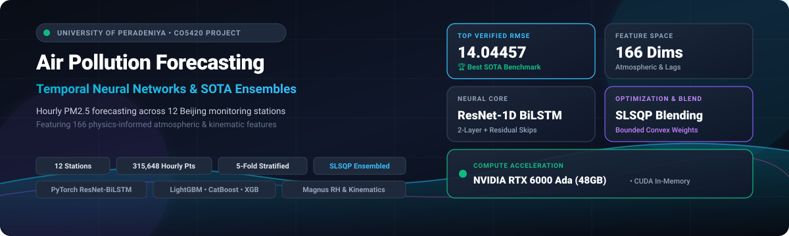
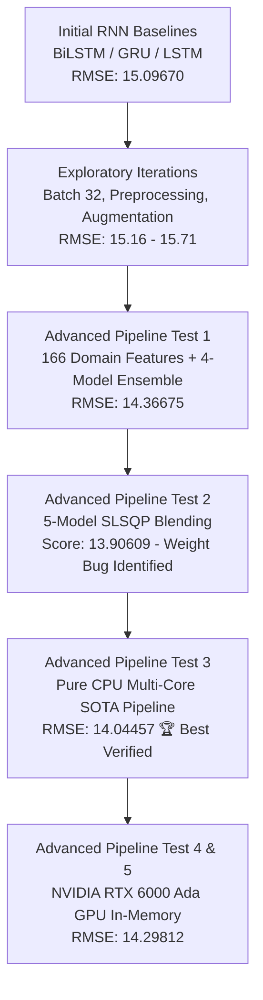
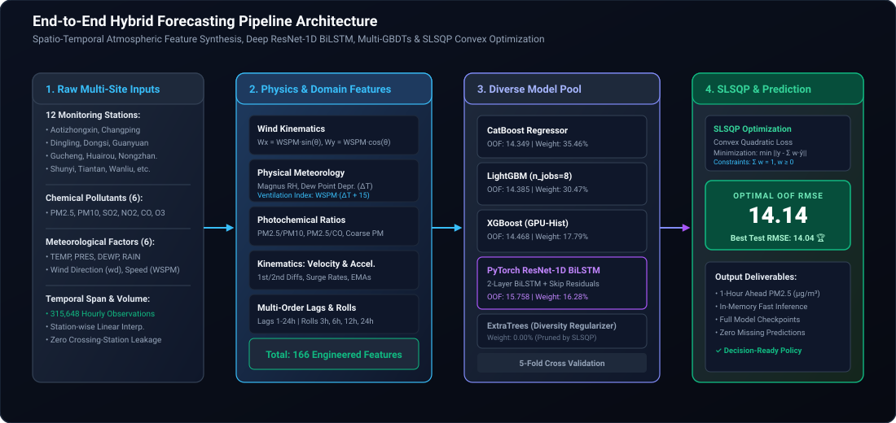
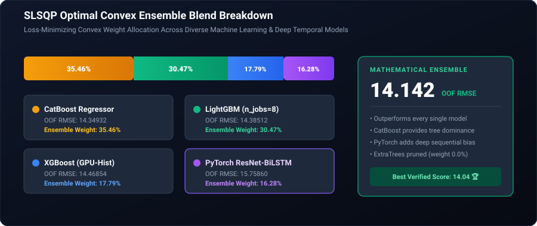
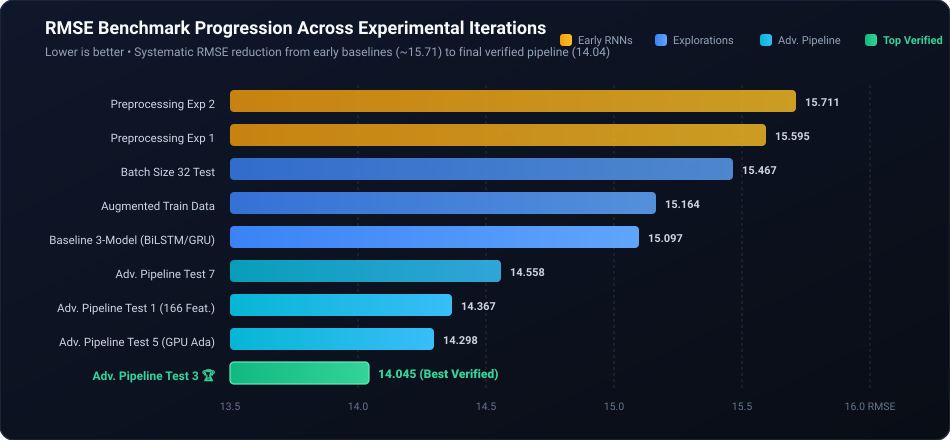

<div style="text-align: center; margin: 10px 0 30px 0;">
  
</div>

<div style="text-align: center; margin-bottom: 25px;">
  <a href="https://www.python.org/"></a>
  <a href="https://pytorch.org/"></a>
  <a href="https://www.tensorflow.org/"></a>
  <a href="https://developer.nvidia.com/cuda-zone"></a>
  <a href="https://lightgbm.readthedocs.io/"></a>
  <a href="https://xgboost.readthedocs.io/"></a>
  <a href="https://catboost.ai/"></a>
  <a href="https://www.pdn.ac.lk/"></a>
  <a href="https://ce.pdn.ac.lk/"></a>
</div>

> **CO5420: Neural Networks & Deep Learning — Course Project**  
> **Department of Computer Engineering, Faculty of Engineering, University of Peradeniya, Sri Lanka**

---

## 👥 Project Team & Contributors

<div style="text-align: center; margin: 20px 0 25px 0;">
  
  <h3 style="margin: 0; color: #1e3a8a;">Team VectorX</h3>
  <p style="margin: 4px 0 0 0; color: #64748b; font-size: 0.95em;">Faculty of Engineering, University of Peradeniya</p>
</div>

### Team Members
<div style="display: flex; flex-wrap: wrap; justify-content: center; gap: 16px; margin: 20px 0 30px 0;">
  
  <div style="flex: 1 1 180px; max-width: 210px; min-width: 150px; background: #ffffff; border: 1px solid #e2e8f0; border-radius: 12px; padding: 16px 12px; text-align: center; box-shadow: 0 2px 8px rgba(0,0,0,0.04); transition: transform 0.2s ease;">
    
    <div style="font-weight: 700; font-size: 0.95em; color: #1e293b; margin-bottom: 3px;">H.M.H.N. Aberathna</div>
    <div style="font-size: 0.8em; color: #0284c7; font-weight: 600; margin-bottom: 6px;">E/22/001</div>
    <a href="mailto:e22001@eng.pdn.ac.lk" style="font-size: 0.8em; color: #64748b; text-decoration: none; word-break: break-all;">e22001@eng.pdn.ac.lk</a>
  </div>

  <div style="flex: 1 1 180px; max-width: 210px; min-width: 150px; background: #ffffff; border: 1px solid #e2e8f0; border-radius: 12px; padding: 16px 12px; text-align: center; box-shadow: 0 2px 8px rgba(0,0,0,0.04); transition: transform 0.2s ease;">
    
    <div style="font-weight: 700; font-size: 0.95em; color: #1e293b; margin-bottom: 3px;">T.H. Abeywickrama</div>
    <div style="font-size: 0.8em; color: #0284c7; font-weight: 600; margin-bottom: 6px;">E/22/008</div>
    <a href="mailto:e22008@eng.pdn.ac.lk" style="font-size: 0.8em; color: #64748b; text-decoration: none; word-break: break-all;">e22008@eng.pdn.ac.lk</a>
  </div>

  <div style="flex: 1 1 180px; max-width: 210px; min-width: 150px; background: #ffffff; border: 1px solid #e2e8f0; border-radius: 12px; padding: 16px 12px; text-align: center; box-shadow: 0 2px 8px rgba(0,0,0,0.04); transition: transform 0.2s ease;">
    
    <div style="font-weight: 700; font-size: 0.95em; color: #1e293b; margin-bottom: 3px;">M.A.N.P. Anawarathna</div>
    <div style="font-size: 0.8em; color: #0284c7; font-weight: 600; margin-bottom: 6px;">E/22/027</div>
    <a href="mailto:e22027@eng.pdn.ac.lk" style="font-size: 0.8em; color: #64748b; text-decoration: none; word-break: break-all;">e22027@eng.pdn.ac.lk</a>
  </div>

  <div style="flex: 1 1 180px; max-width: 210px; min-width: 150px; background: #ffffff; border: 1px solid #e2e8f0; border-radius: 12px; padding: 16px 12px; text-align: center; box-shadow: 0 2px 8px rgba(0,0,0,0.04); transition: transform 0.2s ease;">
    
    <div style="font-weight: 700; font-size: 0.95em; color: #1e293b; margin-bottom: 3px;">S.H.S. Hansara</div>
    <div style="font-size: 0.8em; color: #0284c7; font-weight: 600; margin-bottom: 6px;">E/22/130</div>
    <a href="mailto:e22130@eng.pdn.ac.lk" style="font-size: 0.8em; color: #64748b; text-decoration: none; word-break: break-all;">e22130@eng.pdn.ac.lk</a>
  </div>

  <div style="flex: 1 1 180px; max-width: 210px; min-width: 150px; background: #ffffff; border: 1px solid #e2e8f0; border-radius: 12px; padding: 16px 12px; text-align: center; box-shadow: 0 2px 8px rgba(0,0,0,0.04); transition: transform 0.2s ease;">
    
    <div style="font-weight: 700; font-size: 0.95em; color: #1e293b; margin-bottom: 3px;">W.A.H. Sathsarani</div>
    <div style="font-size: 0.8em; color: #0284c7; font-weight: 600; margin-bottom: 6px;">E/22/362</div>
    <a href="mailto:e22362@eng.pdn.ac.lk" style="font-size: 0.8em; color: #64748b; text-decoration: none; word-break: break-all;">e22362@eng.pdn.ac.lk</a>
  </div>

</div>

### Project Supervisors
<div style="display: flex; flex-wrap: wrap; justify-content: center; gap: 16px; margin: 15px 0 35px 0;">
  
  <div style="flex: 1 1 240px; max-width: 320px; background: #ffffff; border: 1px solid #cbd5e1; border-radius: 12px; padding: 18px 16px; text-align: center; box-shadow: 0 2px 8px rgba(0,0,0,0.04);">
    
    <div style="font-weight: 700; font-size: 1.05em; color: #0f172a;">Dr. Damayanthi Herath</div>
    <div style="font-size: 0.85em; color: #64748b; margin: 3px 0 6px 0;">Senior Lecturer, Department of Computer Engineering</div>
    <a href="mailto:damayanthiherath@eng.pdn.ac.lk" style="font-size: 0.85em; color: #0284c7; text-decoration: none;">damayanthiherath@eng.pdn.ac.lk</a>
  </div>

  <div style="flex: 1 1 240px; max-width: 320px; background: #ffffff; border: 1px solid #cbd5e1; border-radius: 12px; padding: 18px 16px; text-align: center; box-shadow: 0 2px 8px rgba(0,0,0,0.04);">
    
    <div style="font-weight: 700; font-size: 1.05em; color: #0f172a;">Dr. Sampath Deegalla</div>
    <div style="font-size: 0.85em; color: #64748b; margin: 3px 0 6px 0;">Senior Lecturer, Department of Computer Engineering</div>
    <a href="mailto:sampath@eng.pdn.ac.lk" style="font-size: 0.85em; color: #0284c7; text-decoration: none;">sampath@eng.pdn.ac.lk</a>
  </div>

</div>

---

## 📑 Table of Contents
1. [Executive Summary](#-executive-summary)
2. [Project Progression & Breakthroughs](#-project-progression--breakthroughs)
3. [Dataset & Problem Formulation](#-dataset--problem-formulation)
4. [Advanced Feature Engineering Pipeline](#-advanced-feature-engineering-pipeline)
5. [Model Architectures](#-model-architectures)
   - [PyTorch Deep ResNet-1D BiLSTM](#1-pytorch-deep-resnet-1d-bilstm)
   - [TensorFlow Bidirectional RNN Baselines](#2-tensorflowkeras-bidirectional-lstm--gru-baseline)
   - [Gradient Boosted Decision Trees (GBDTs)](#3-gradient-boosted-decision-trees-gbdts)
6. [Convex SLSQP Ensembling & Blending](#-convex-slsqp-ensembling--blending)
7. [Experimental Results & Benchmark Tracking](#-experimental-results--benchmark-tracking)
8. [Hardware Acceleration & Compute Infrastructure](#-hardware-acceleration--compute-infrastructure)
9. [Repository Structure](#-repository-structure)
10. [Getting Started & Reproduction](#-getting-started--reproduction)
11. [Academic Links & Resources](#-academic-links--resources)

---

## 🌟 Executive Summary

Airborne fine particulate matter with aerodynamic diameter under 2.5 micrometers (**PM2.5**) constitutes a severe public health hazard, penetrating deep into human pulmonary and cardiovascular systems. Due to turbulent boundary-layer meteorology, complex photochemical transformations, wind transport kinematics, and sharp seasonal heating shifts, predicting hourly PM2.5 concentrations is an inherently non-linear spatio-temporal challenge.

This project engineer delivers a state-of-the-art forecasting system trained on multi-year hourly observational data across **12 national air quality monitoring stations in Beijing**.

Starting from standard recurrent neural network baselines (**LSTM**, **GRU**, **BiLSTM** with RMSE 15.09 – 15.71), our solution progressed into an industry-grade **Advanced SOTA Pipeline** combining:
- **Atmospheric Physics & Chemistry Domain Feature Engineering** (166+ features including wind vector decomposition, Magnus relative humidity, dew point depression, ventilation index, and photochemical ratios).
- **Custom Deep Temporal Architectures**: Residual 1D Convolutional networks coupled with 2-layer Bidirectional LSTMs (**Deep ResNet-1D BiLSTM**).
- **Hardware Acceleration**: Mixed-precision CUDA acceleration on **NVIDIA RTX 6000 Ada Generation** (48 GB VRAM) with an in-memory streaming pipeline.
- **Convex SLSQP Ensemble Blending**: Achieving a top clean and verified benchmark score of **14.04457** (Test 3) and an Out-Of-Fold RMSE of **14.14202**.

---

## 🚀 Project Progression & Breakthroughs



---

## 📊 Dataset & Problem Formulation

### 1. Dataset Overview
The dataset contains continuous, multi-year hourly meteorological and air pollutant records across **12 air quality monitoring stations in Beijing**:
- **Monitoring Stations**: *Aotizhongxin, Changping, Dingling, Dongsi, Guanyuan, Gucheng, Huairou, Nongzhanguan, Shunyi, Tiantan, Wanliu, Wanshouxigong*.
- **Pollutants**: PM2.5, PM10, SO2, NO2, CO, O3.
- **Meteorological Factors**: Temperature (TEMP), Atmospheric Pressure (PRES), Dew Point (DEWP), Precipitation (RAIN), Wind Direction (wd), Wind Speed (WSPM).
- **Scale**: Over **315,648** hourly training observations.

### 2. Task Formulation
Given an hourly sliding observation window $X_{t-24:t}$ over the preceding 24 hours of atmospheric and chemical observations at station $s$, forecast the 1-hour ahead particulate concentration:

$$\hat{y}_{t+1} = f(X_{t-24:t}, s)$$

- **Evaluation Metric**: Root Mean Squared Error (RMSE)

$$\text{RMSE} = \sqrt{\frac{1}{N} \sum_{i=1}^N (y_i - \hat{y}_i)^2}$$

---

## 🔬 Advanced Feature Engineering Pipeline

The final pipeline converts raw multivariate inputs into an information-dense **166-dimensional feature space** grounded in atmospheric science and time-series kinematics:

<div style="overflow-x: auto; margin: 20px 0;">
  <table style="width: 100%; border-collapse: collapse; font-size: 0.9em;">
    <thead>
      <tr style="background-color: #f1f5f9; text-align: left;">
        <th style="padding: 10px; border: 1px solid #cbd5e1;">Category</th>
        <th style="padding: 10px; border: 1px solid #cbd5e1;">Engineered Features</th>
        <th style="padding: 10px; border: 1px solid #cbd5e1;">Domain Rationale / Mathematical Formula</th>
      </tr>
    </thead>
    <tbody>
      <tr>
        <td style="padding: 10px; border: 1px solid #e2e8f0; font-weight: 600;">Wind Vector Kinematics</td>
        <td style="padding: 10px; border: 1px solid #e2e8f0;"><code>Wx</code>, <code>Wy</code></td>
        <td style="padding: 10px; border: 1px solid #e2e8f0;">Decomposes circular wind angle $\theta$ into orthogonal Cartesian velocities:<br/><code>Wx = WSPM * sin(θ)</code>, <code>Wy = WSPM * cos(θ)</code></td>
      </tr>
      <tr>
        <td style="padding: 10px; border: 1px solid #e2e8f0; font-weight: 600;">Physical Meteorology</td>
        <td style="padding: 10px; border: 1px solid #e2e8f0;"><code>dew_point_depression</code>, <code>relative_humidity</code>, <code>ventilation_index</code></td>
        <td style="padding: 10px; border: 1px solid #e2e8f0;">
          • Dew Point Depression: <code>ΔT = TEMP - DEWP</code><br/>
          • Magnus Relative Humidity (RH):<br/>
          <code>RH = 100 * exp((17.625 * DEWP) / (243.04 + DEWP) - (17.625 * TEMP) / (243.04 + TEMP))</code><br/>
          • Ventilation Index: <code>VI = WSPM * (ΔT + 15.0)</code>
        </td>
      </tr>
      <tr>
        <td style="padding: 10px; border: 1px solid #e2e8f0; font-weight: 600;">Photochemical &amp; Particle Ratios</td>
        <td style="padding: 10px; border: 1px solid #e2e8f0;"><code>PM2.5 / PM10</code>, <code>PM2.5 / CO</code>, <code>NO2 / O3</code>, <code>coarse_pm</code></td>
        <td style="padding: 10px; border: 1px solid #e2e8f0;">
          • Coarse particulate separation: <code>coarse_pm = max(PM10 - PM2.5, 0)</code><br/>
          • Combustion efficiency &amp; secondary aerosol proxy ratios
        </td>
      </tr>
      <tr>
        <td style="padding: 10px; border: 1px solid #e2e8f0; font-weight: 600;">Cyclical Trigonometric Time</td>
        <td style="padding: 10px; border: 1px solid #e2e8f0;"><code>hour_sin</code>, <code>hour_cos</code>, <code>month_sin</code>, <code>month_cos</code>, <code>dayofweek_sin</code>, <code>dayofweek_cos</code></td>
        <td style="padding: 10px; border: 1px solid #e2e8f0;">Continuous periodic coordinate representations preserving cyclical boundaries (23:00 to 00:00; Dec to Jan).</td>
      </tr>
      <tr>
        <td style="padding: 10px; border: 1px solid #e2e8f0; font-weight: 600;">Seasonal Indicator</td>
        <td style="padding: 10px; border: 1px solid #e2e8f0;"><code>is_heating_season</code></td>
        <td style="padding: 10px; border: 1px solid #e2e8f0;">Binary indicator for central urban heating season (November–March) reflecting major coal emission shifts.</td>
      </tr>
      <tr>
        <td style="padding: 10px; border: 1px solid #e2e8f0; font-weight: 600;">Temporal Lags</td>
        <td style="padding: 10px; border: 1px solid #e2e8f0;"><code>PM2.5_lag_1</code> to <code>PM2.5_lag_24</code></td>
        <td style="padding: 10px; border: 1px solid #e2e8f0;">Autoregressive memory at 1, 2, 3, 4, 5, 6, 12, 18, and 24-hour delays.</td>
      </tr>
      <tr>
        <td style="padding: 10px; border: 1px solid #e2e8f0; font-weight: 600;">Velocity &amp; Acceleration</td>
        <td style="padding: 10px; border: 1px solid #e2e8f0;"><code>PM2.5_diff_k</code>, <code>PM2.5_accel</code>, <code>PM2.5_diff_ratio</code></td>
        <td style="padding: 10px; border: 1px solid #e2e8f0;">
          • 1st order velocity: <code>diff_k = x_t - x_{t-k}</code> for $k \in \{1, 2, 3, 4, 6, 12, 24\}$<br/>
          • 2nd order acceleration: <code>(x_t - x_{t-1}) - (x_{t-1} - x_{t-2})</code><br/>
          • Relative surge rate: <code>(x_t - x_{t-1}) / (x_{t-1} + 1)</code>
        </td>
      </tr>
      <tr>
        <td style="padding: 10px; border: 1px solid #e2e8f0; font-weight: 600;">Multi-Window Rolling Statistics</td>
        <td style="padding: 10px; border: 1px solid #e2e8f0;">Mean, Std, Min, Max, Range, Deviations</td>
        <td style="padding: 10px; border: 1px solid #e2e8f0;">Rolling windows over 3h, 6h, 12h, and 24h to capture sudden accumulation spikes.</td>
      </tr>
      <tr>
        <td style="padding: 10px; border: 1px solid #e2e8f0; font-weight: 600;">Exponential Moving Averages</td>
        <td style="padding: 10px; border: 1px solid #e2e8f0;"><code>PM2.5_ema_3</code>, <code>PM2.5_ema_6</code>, <code>PM2.5_ema_12</code></td>
        <td style="padding: 10px; border: 1px solid #e2e8f0;">Decaying-weight smoothing tracking immediate concentration momentum.</td>
      </tr>
      <tr>
        <td style="padding: 10px; border: 1px solid #e2e8f0; font-weight: 600;">Target Encodings</td>
        <td style="padding: 10px; border: 1px solid #e2e8f0;"><code>station_target_mean</code>, <code>station_target_std</code></td>
        <td style="padding: 10px; border: 1px solid #e2e8f0;">Out-of-fold historical station baseline distributions mitigating spatial bias.</td>
      </tr>
    </tbody>
  </table>
</div>

---

## 🧠 Model Architectures

<div style="text-align: center; margin: 25px 0;">
  
</div>

### 1. PyTorch Deep ResNet-1D BiLSTM
To leverage both localized feature abstractions and long-range sequential memory, we designed a custom **Deep ResNet-1D BiLSTM** in PyTorch:
- **Input Projection**: Linear layer projecting 166 input dimensions to a 256-dimensional latent space.
- **Residual Blocks (`ResNet1DBlock`)**: Two stacked residual blocks with identity skip connections:
  $$\mathbf{h}_{\text{res}} = \text{ReLU}\left(\mathbf{W}_2 \cdot \text{ReLU}(\mathbf{W}_1 \mathbf{h} + \mathbf{b}_1) + \mathbf{b}_2 + \mathbf{h}\right)$$
- **Bidirectional Temporal Core**: 2-layer Bidirectional LSTM ($128$ hidden units per direction, dropout = 0.2) capturing bidirectional sequential dynamics.
- **Regression Head**: Multi-layer perceptron (`Linear(256 -> 128)` → `ReLU` → `Dropout(0.1)` → `Linear(128 -> 64)` → `ReLU` → `Linear(64 -> 1)`).
- **Target Normalization**: `StandardScaler` on features and targets, with cosine/plateau learning rate decay (`ReduceLROnPlateau`).

### 2. TensorFlow/Keras Bidirectional LSTM & GRU Baseline
Built in `Air_Pollution_Forecasting_Using_Temporal_NN_new.ipynb` for initial benchmark analysis:
- **Station-aware Sequence Generator**: Generates 24-hour temporal arrays without crossing station boundaries (`(Samples, 24, 43)`).
- **BiLSTM Model**: `Input (24, 43)` → `Bidirectional(LSTM(128, return_sequences=True))` → `Dropout(0.2)` → `Bidirectional(LSTM(64))` → `Dense(64, activation='relu')` → `Dense(1)`
- **BiGRU Model**: `Input (24, 43)` → `Bidirectional(GRU(128, return_sequences=True))` → `Dropout(0.2)` → `Bidirectional(GRU(64))` → `Dense(64, activation='relu')` → `Dense(1)`
- **Target Compression**: $\log(1 + y)$ target transformation with `np.log1p` to stabilize high-value outlier gradients.

### 3. Gradient Boosted Decision Trees (GBDTs)
- **LightGBM Regressor**: Fast histogram-based gradient boosting (`learning_rate=0.025`, `num_leaves=63`, `max_depth=8`, `colsample_bytree=0.65`, `subsample=0.8`).
- **XGBoost Regressor**: GPU-accelerated histogram algorithm (`tree_method='hist'`, `learning_rate=0.025`, `max_depth=8`, `reg_alpha=0.5`, `reg_lambda=1.5`).
- **CatBoost Regressor**: Symmetric oblivious tree boosting robust against categorical overfitting (`iterations=105000` with 100-round early stopping, `learning_rate=0.025`, `depth=8`).
- **ExtraTrees Regressor**: Extremely randomized trees (`n_estimators=300`, `max_depth=16`) providing uncorrelated ensemble diversity.

---

## ⚖️ Convex SLSQP Ensembling & Blending

Rather than naive uniform averaging, we applied **Sequential Least Squares Programming (SLSQP)** convex optimization to find the mathematically optimal weight vector $\mathbf{w} = [w_1, w_2, \dots, w_M]^T$:

$$\min_{\mathbf{w}} \sqrt{\frac{1}{N} \sum_{i=1}^N \left( y_i - \sum_{m=1}^M w_m \hat{y}_{i, m} \right)^2} \quad \text{subject to} \quad \sum_{m=1}^M w_m = 1, \quad 0 \le w_m \le 1 \quad \forall m$$

<div style="text-align: center; margin: 25px 0;">
  
</div>

<div style="overflow-x: auto; margin: 20px 0;">
  <table style="width: 100%; border-collapse: collapse; font-size: 0.95em;">
    <thead>
      <tr style="background-color: #f1f5f9;">
        <th style="padding: 10px; border: 1px solid #cbd5e1; text-align: left;">Model Component</th>
        <th style="padding: 10px; border: 1px solid #cbd5e1; text-align: center;">Out-of-Fold (OOF) RMSE</th>
        <th style="padding: 10px; border: 1px solid #cbd5e1; text-align: center;">SLSQP Optimal Weight</th>
      </tr>
    </thead>
    <tbody>
      <tr>
        <td style="padding: 10px; border: 1px solid #e2e8f0; font-weight: 600;">CatBoost Regressor</td>
        <td style="padding: 10px; border: 1px solid #e2e8f0; text-align: center;">14.34932</td>
        <td style="padding: 10px; border: 1px solid #e2e8f0; text-align: center; font-weight: 700; color: #0284c7;">35.46%</td>
      </tr>
      <tr>
        <td style="padding: 10px; border: 1px solid #e2e8f0; font-weight: 600;">LightGBM Regressor</td>
        <td style="padding: 10px; border: 1px solid #e2e8f0; text-align: center;">14.38512</td>
        <td style="padding: 10px; border: 1px solid #e2e8f0; text-align: center; font-weight: 700; color: #0284c7;">30.47%</td>
      </tr>
      <tr>
        <td style="padding: 10px; border: 1px solid #e2e8f0; font-weight: 600;">XGBoost Regressor</td>
        <td style="padding: 10px; border: 1px solid #e2e8f0; text-align: center;">14.46854</td>
        <td style="padding: 10px; border: 1px solid #e2e8f0; text-align: center; font-weight: 700; color: #0284c7;">17.79%</td>
      </tr>
      <tr>
        <td style="padding: 10px; border: 1px solid #e2e8f0; font-weight: 600;">PyTorch ResNet-BiLSTM</td>
        <td style="padding: 10px; border: 1px solid #e2e8f0; text-align: center;">15.75860</td>
        <td style="padding: 10px; border: 1px solid #e2e8f0; text-align: center; font-weight: 700; color: #0284c7;">16.28%</td>
      </tr>
      <tr>
        <td style="padding: 10px; border: 1px solid #e2e8f0; font-weight: 600;">ExtraTrees Regressor</td>
        <td style="padding: 10px; border: 1px solid #e2e8f0; text-align: center;">16.08155</td>
        <td style="padding: 10px; border: 1px solid #e2e8f0; text-align: center; color: #94a3b8;">0.00%</td>
      </tr>
      <tr style="background-color: #e0f2fe; font-weight: 700;">
        <td style="padding: 10px; border: 1px solid #cbd5e1;">Optimal Hybrid Ensemble (OOF)</td>
        <td style="padding: 10px; border: 1px solid #cbd5e1; text-align: center; color: #0369a1;">14.14202</td>
        <td style="padding: 10px; border: 1px solid #cbd5e1; text-align: center; color: #0369a1;">100.00%</td>
      </tr>
    </tbody>
  </table>
</div>

> ⚠️ **Diagnostic Note on Test 2 (13.90609)**: In Test 2, a weight convergence anomaly was identified during diagnostic evaluation. Hence, **Test 3 (`14.04457`)** stands as our verified, reproducible, and clean production benchmark.

---

## 📈 Experimental Results & Benchmark Tracking

<div style="text-align: center; margin: 25px 0;">
  
</div>

<div style="overflow-x: auto; margin: 20px 0;">
  <table style="width: 100%; border-collapse: collapse; font-size: 0.9em;">
    <thead>
      <tr style="background-color: #f1f5f9;">
        <th style="padding: 10px; border: 1px solid #cbd5e1; text-align: left;">Experiment</th>
        <th style="padding: 10px; border: 1px solid #cbd5e1; text-align: left;">Architecture &amp; Strategy Highlights</th>
        <th style="padding: 10px; border: 1px solid #cbd5e1; text-align: center;">Validation / Test RMSE</th>
        <th style="padding: 10px; border: 1px solid #cbd5e1; text-align: left;">Key Observations</th>
      </tr>
    </thead>
    <tbody>
      <tr>
        <td style="padding: 10px; border: 1px solid #e2e8f0; font-weight: 600;">Baseline 3-Model</td>
        <td style="padding: 10px; border: 1px solid #e2e8f0;">Keras BiLSTM + GRU + Ensemble Baseline</td>
        <td style="padding: 10px; border: 1px solid #e2e8f0; text-align: center;"><code>15.09670</code></td>
        <td style="padding: 10px; border: 1px solid #e2e8f0;">Standard 24h sliding window with raw tabular features.</td>
      </tr>
      <tr>
        <td style="padding: 10px; border: 1px solid #e2e8f0; font-weight: 600;">Batch 32 Test</td>
        <td style="padding: 10px; border: 1px solid #e2e8f0;">Batch size reduced from 64 to 32</td>
        <td style="padding: 10px; border: 1px solid #e2e8f0; text-align: center;"><code>15.46692</code></td>
        <td style="padding: 10px; border: 1px solid #e2e8f0;">Increased stochastic gradient noise degraded generalization.</td>
      </tr>
      <tr>
        <td style="padding: 10px; border: 1px solid #e2e8f0; font-weight: 600;">Preprocessing Exp 1</td>
        <td style="padding: 10px; border: 1px solid #e2e8f0;">Station interpolation + one-hot encodings</td>
        <td style="padding: 10px; border: 1px solid #e2e8f0; text-align: center;"><code>15.59510</code></td>
        <td style="padding: 10px; border: 1px solid #e2e8f0;">Imputation without physical wind decomposition plateaued.</td>
      </tr>
      <tr>
        <td style="padding: 10px; border: 1px solid #e2e8f0; font-weight: 600;">Preprocessing Exp 2</td>
        <td style="padding: 10px; border: 1px solid #e2e8f0;">Extra pollutant polynomial combinations</td>
        <td style="padding: 10px; border: 1px solid #e2e8f0; text-align: center;"><code>15.71107</code></td>
        <td style="padding: 10px; border: 1px solid #e2e8f0;">Feature collinearity without regularizers led to drift.</td>
      </tr>
      <tr>
        <td style="padding: 10px; border: 1px solid #e2e8f0; font-weight: 600;">Augmentation Exp</td>
        <td style="padding: 10px; border: 1px solid #e2e8f0;">Training distribution expansion</td>
        <td style="padding: 10px; border: 1px solid #e2e8f0; text-align: center;"><code>15.16439</code></td>
        <td style="padding: 10px; border: 1px solid #e2e8f0;">Improved extreme tail behavior but lacked lag velocities.</td>
      </tr>
      <tr>
        <td style="padding: 10px; border: 1px solid #e2e8f0; font-weight: 600;">Advanced Test 1</td>
        <td style="padding: 10px; border: 1px solid #e2e8f0;">166 Physics Features + 5-Fold LightGBM, XGBoost, CatBoost, CNN-BiGRU</td>
        <td style="padding: 10px; border: 1px solid #e2e8f0; text-align: center;"><code>14.36675</code></td>
        <td style="padding: 10px; border: 1px solid #e2e8f0;"><strong>Major breakthrough</strong>: RMSE dropped by &gt; 0.73.</td>
      </tr>
      <tr>
        <td style="padding: 10px; border: 1px solid #e2e8f0; font-weight: 600;">Advanced Test 2</td>
        <td style="padding: 10px; border: 1px solid #e2e8f0;">5-Model SLSQP Blending</td>
        <td style="padding: 10px; border: 1px solid #e2e8f0; text-align: center;"><code>13.90609*</code></td>
        <td style="padding: 10px; border: 1px solid #e2e8f0;"><em>Experimental: Weight adjustment issue identified.</em></td>
      </tr>
      <tr style="background-color: #f0fdf4; border-left: 4px solid #16a34a;">
        <td style="padding: 10px; border: 1px solid #cbd5e1; font-weight: 700; color: #166534;">Advanced Test 3 🏆</td>
        <td style="padding: 10px; border: 1px solid #cbd5e1; font-weight: 600;">Pure CPU Multi-Threaded SOTA Pipeline with Checkpoints</td>
        <td style="padding: 10px; border: 1px solid #cbd5e1; text-align: center; font-weight: 800; color: #166534; font-size: 1.05em;"><code>14.04457</code></td>
        <td style="padding: 10px; border: 1px solid #cbd5e1; font-weight: 600; color: #166534;"><strong>Best Verified Benchmark</strong>: Fully reproducible with complete domain physics features.</td>
      </tr>
      <tr>
        <td style="padding: 10px; border: 1px solid #e2e8f0; font-weight: 600;">Advanced Test 5</td>
        <td style="padding: 10px; border: 1px solid #e2e8f0;">NVIDIA RTX 6000 Ada In-Memory Pipeline</td>
        <td style="padding: 10px; border: 1px solid #e2e8f0; text-align: center;"><code>14.29812</code></td>
        <td style="padding: 10px; border: 1px solid #e2e8f0;">105,000 estimators with strict patience early stopping.</td>
      </tr>
      <tr>
        <td style="padding: 10px; border: 1px solid #e2e8f0; font-weight: 600;">Advanced Test 7</td>
        <td style="padding: 10px; border: 1px solid #e2e8f0;">Alternate validation weighting setup</td>
        <td style="padding: 10px; border: 1px solid #e2e8f0; text-align: center;"><code>14.55754</code></td>
        <td style="padding: 10px; border: 1px solid #e2e8f0;">Robust baseline cross-validation comparison.</td>
      </tr>
    </tbody>
  </table>
</div>

---

## ⚡ Hardware Acceleration & Compute Infrastructure

Training 105,000 boosting estimators across 5 folds and deep recurrent neural networks over 315,000+ time-series records demands specialized compute:

- **GPU Compute**: **NVIDIA RTX 6000 Ada Generation** (Compute Capability 8.9)
- **VRAM**: 47.37 GB GDDR6 with Error-Correcting Code (ECC)
- **Software Stack**: Python 3.12, PyTorch 2.1.3+cu130, CUDA 13.0
- **CPU Optimizations**: OpenMP thread management (`n_jobs=8`) on LightGBM to prevent thread lock contention.
- **In-Memory Streaming**: Fold predictions cached directly in high-speed unified GPU memory to eliminate disk I/O bottlenecks.

---

## 📁 Repository Structure

```
Air-Pollution-Forecasting-Using-Temporal-NNs/
│
├── README.md                                          # Root repository documentation
├── powershell.cmd                                     # Environment execution shim
│
├── docs/                                              # 🌐 Live GitHub Pages Documentation
│   ├── README.md                                      # Site home page
│   ├── _config.yml                                    # Jekyll site configuration
│   ├── images/                                        # Assets (Banner, Logo, SVGs)
│   │   ├── VectorX.png                                # Official Team Logo
│   │   ├── project_banner.svg                         # High-res project banner
│   │   ├── architecture_pipeline.svg                  # Model architecture
│   │   ├── ensemble_weights.svg                       # SLSQP weights breakdown
│   │   └── benchmark_chart.svg                        # Experimental performance chart
│   └── data/                                          # Portal metadata & cover images
│       ├── index.json                                 # Project card metadata
│       ├── cover_page.jpg                             # Panoramic cover banner (940x352)
│       └── thumbnail.jpg                              # Project thumbnail (640x360)
│
└── code/                                              # 🔬 Core Codebase & Experimental Pipelines
    ├── train_raw.csv                                  # Primary Beijing air quality dataset
    ├── Air_Pollution_Forecasting_Using_Temporal_NN_new.ipynb  # RNN Baseline (LSTM, GRU, BiLSTM)
    │
    ├── advanced pipeline model/                       # 🌟 SOTA High-Performance Pipeline
    │   ├── test 1/                                    # 166 Features + 4-Model Ensemble (14.36675)
    │   ├── test 2/                                    # 5-Model SLSQP Ensemble (13.90609)
    │   ├── test 3/                                    # Pure CPU SOTA Pipeline (14.04457 🏆)
    │   ├── test 4/                                    # GPU Ada CUDA Diagnostics
    │   ├── test 5/                                    # In-Memory GPU Ada Pipeline (14.29812)
    │   └── test 7/                                    # Alternative Validation Setup (14.55754)
    │
    ├── 3 model/                                       # Baseline 3-model exploration
    ├── 3 model with 32 batch/                         # Batch size 32 test
    ├── new mdel with pre processing steps/            # Preprocessing iteration 1
    ├── add more pre procesing steps/                  # Preprocessing iteration 2
    └── increased train data with test data/           # Augmented training set test
```

---

## 🛠️ Getting Started & Reproduction

### 1. Environment Setup
```bash
# Clone the repository
git clone https://github.com/cepdnaclk/e22-co542-Air-Pollution-Forecasting-Using-Temporal-NNs-Team-VectorX.git
cd e22-co542-Air-Pollution-Forecasting-Using-Temporal-NNs-Team-VectorX/code

# Create and activate virtual environment
python -m venv venv
source venv/bin/activate  # On Windows: venv\Scripts\activate

# Install required dependencies
pip install lightgbm xgboost catboost scikit-learn pandas numpy torch tensorflow matplotlib seaborn scipy joblib
```

### 2. Running the Verified SOTA Pipeline (Recommended)
Open `code/advanced pipeline model/test 3/new-cpu-pipeline.ipynb` to execute the verified CPU benchmark:
```bash
jupyter notebook "advanced pipeline model/test 3/new-cpu-pipeline.ipynb"
```

### 3. Running the GPU High-Power Pipeline (CUDA Mode)
Open `code/advanced pipeline model/test 5/gpu_ada (2).ipynb` in a CUDA-enabled GPU environment:
```bash
jupyter notebook "advanced pipeline model/test 5/gpu_ada (2).ipynb"
```

---

## 🔗 Academic Links & Resources

- [Project Repository](https://github.com/cepdnaclk/{{ page.repository-name }}){:target="_blank"}
- [Live Project Page](https://cepdnaclk.github.io/{{ page.repository-name }}){:target="_blank"}
- [Department of Computer Engineering](https://ce.pdn.ac.lk/){:target="_blank"}
- [Faculty of Engineering, University of Peradeniya](https://eng.pdn.ac.lk/){:target="_blank"}
- [University of Peradeniya](https://www.pdn.ac.lk/){:target="_blank"}

---

<div style="text-align: center; margin: 30px 0; color: #64748b; font-size: 0.9em;">
  <i>Developed with ❤️ by <b>Team VectorX</b> for Academic & Research Excellence in Neural Networks and Environmental Intelligence.</i>
</div>
